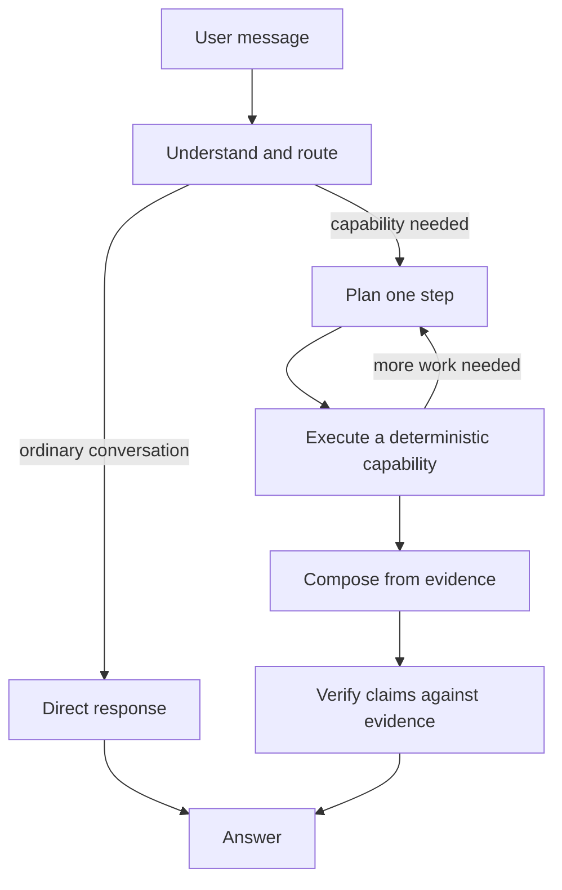

<div align="center">
  
  <h1>Athena</h1>
  <p><strong>A local, evidence-grounded assistant for private files, documents and code.</strong></p>
</div>

Athena is a Windows-first local AI assistant built with FastAPI, Ollama and a
custom browser interface. It can discuss ordinary questions, find and read
documents on the computer, extract text from document images, run controlled
public research, and show the processing route used for each answer.

Current release: **0.1.0-beta**. See the [changelog](CHANGELOG.md).

This repository is an active learning project, not a finished secure product.
Athena can be useful today, but a small local model can still misunderstand a
request or produce a wrong answer. Important outputs should be verified.

## What works

- Persistent local conversations with bounded history and older-message summaries
- Exact and meaning-based document search
- PDF, Word, PowerPoint, Excel, source-code, text and image extraction
- OCR for scans and images embedded in documents when Tesseract is installed
- Evidence IDs and grounding checks for file and web answers
- Current weather, market-price and exchange-rate lookups through keyless APIs
- General web research with visible sources
- Image understanding through a multimodal Ollama model
- General code generation and Python execution
- Fast, Balanced and Max response modes
- Stop, redo, history deletion/undo, token accounting and a live pipeline trace

## How it works



Deterministic services gather facts and perform actions. The model is used for
interpretation, planning and explanation. See [Architecture](docs/architecture.md)
for the complete runtime flow.

## Modes

| Mode | Models | Intended use |
| --- | --- | --- |
| Fast | `qwen3:8b`, with `gemma3:4b` for images | Lowest latency and VRAM use |
| Balanced | `gemma3:12b` | Default balance of quality and waiting time |
| Max | `gemma3:12b` plus computation and self-checking | Important answers where quality matters more than speed |

Only the models needed by the selected mode are kept resident. Model names can
be overridden in `.env`.

## Requirements

- Windows 10 or 11 (the primary tested platform)
- Python 3.11 or newer; development currently uses Python 3.14
- [Ollama](https://ollama.com/) running locally
- Approximately 8 GB VRAM for the supplied model configuration; Balanced and
  Max may partially offload `gemma3:12b` to system memory on an 8 GB GPU
- Tesseract OCR is optional but strongly recommended for scans

## Installation

Clone the repository, then from PowerShell:

```powershell
py -3.14 -m venv .venv
.\.venv\Scripts\Activate.ps1
python -m pip install --upgrade pip
pip install -r requirements.txt
Copy-Item .env.example .env
```

Install the default model:

```powershell
ollama pull gemma3:12b
```

To use every mode and meaning-based document search, also install:

```powershell
ollama pull qwen3:8b
ollama pull gemma3:4b
ollama pull nomic-embed-text
```

Start Athena:

```powershell
python main.py
```

Athena binds to `127.0.0.1:8000` and opens the browser automatically. Press
Ctrl+C in the terminal to stop the server and unload its Ollama models.

### Optional OCR

Install Tesseract and either add it to `PATH` or set `TESSERACT_CMD` in `.env`:

```dotenv
TESSERACT_CMD=C:\Program Files\Tesseract-OCR\tesseract.exe
```

Without Tesseract, normal document text still works, but scans and text inside
images may not be readable.

## Configuration

Copy `.env.example` to `.env`. Available settings:

| Variable | Default | Purpose |
| --- | --- | --- |
| `ATHENA_HOST` | `127.0.0.1` | Local server interface |
| `ATHENA_PORT` | `8000` | Local server port |
| `ATHENA_DATA_DIR` | repository directory | Conversations and generated workspace |
| `ATHENA_BALANCED_MODEL` | `gemma3:12b` | Balanced/Max model |
| `ATHENA_FAST_MODEL` | `qwen3:8b` | Fast text model |
| `ATHENA_FAST_VISION_MODEL` | `gemma3:4b` | Fast image model |
| `ATHENA_EMBED_MODEL` | `nomic-embed-text` | Semantic-search embedding model |
| `ATHENA_MAX_FILE_SIZE` | `10485760` | Maximum readable file size in bytes |
| `TESSERACT_CMD` | auto-detected | Full OCR executable path |

Keep `ATHENA_HOST=127.0.0.1`. Athena has no authentication and is not designed
to be exposed to a LAN or the public internet.

## Privacy and safety boundaries

- Document extraction, conversation storage and model inference are local.
- Weather, finance and web-research capabilities make public internet requests.
  Athena does not yet provide a hard network-off Private Mode.
- Conversations are plain JSON files under `conversations/` by default. They
  are ignored by Git but are not encrypted.
- Common credentials and private-key files are refused by the filesystem reader.
- Athena's static prompts and architecture are public repository content and may
  be explained by the model. Private conversation state, document text,
  credentials and dynamically assembled evidence remain private runtime data.
- Generated Python runs in a subprocess with a timeout. **It is not sandboxed**
  and can access files and the network with the current user's permissions.
- Athena is not legal, medical, financial or compliance advice and should not
  be used to make unattended high-stakes decisions.

Read [SECURITY.md](SECURITY.md) before using Athena with sensitive material.

## Testing

Install development dependencies:

```powershell
pip install -r requirements-dev.txt
```

Run the deterministic suite (no Ollama or internet required):

```powershell
python tests/test_regressions.py
```

Run real-model quality checks manually before a release:

```powershell
python tests/eval_quality.py
python tests/deep_test.py
```

The real-model tests are slow and some cases require internet access. They test
answer properties rather than exact wording because local model output varies.

## Project layout

```text
core/       routing, planning, orchestration, prompts and web interface
models/     Ollama model adapter and token accounting
services/   filesystem, OCR, web, live data, code and conversation services
tests/      deterministic regressions and optional real-model evaluations
workspace/  generated scripts and semantic index (ignored by Git)
```

## Contributing

Bug reports should include the exact conversation that failed, the selected
mode, capabilities shown in the pipeline, and sanitized logs. See
[CONTRIBUTING.md](CONTRIBUTING.md).

## License

[MIT](LICENSE) © 2026 Parth Singhal.
