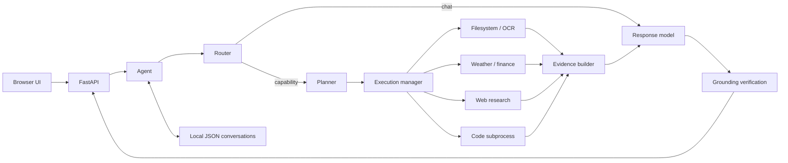

# Athena architecture

Athena is deliberately split into model judgment and deterministic execution.
The model decides what a request means and how to explain the result; services
read files, call public endpoints and run code.

## Runtime flow

1. `main.py` starts the loopback-only FastAPI server and opens the browser.
2. `core/web_app.py` serializes requests through one global `Agent` and exposes
   progress, modes, history, stop and retry endpoints.
3. `core/router.py` handles unambiguous cases deterministically, then asks a
   compact model classifier whether the message is chat, calculation, lookup or
   an active-file follow-up.
4. Ordinary chat goes directly to the response model.
5. Capability requests enter `core/planner.py`, which selects one permitted step
   at a time. The agent executes at most four steps and prevents duplicate work.
6. `core/execution_manager.py` dispatches each step to a deterministic service.
7. `core/prompt_builder.py` turns results into typed evidence with stable IDs.
8. The response model composes an answer and `core/agent.py` checks its claims
   against the cited file, web, system or code evidence.
9. The turn is stored locally and returned with timing, tokens, sources and the
   processing trail used by the interface.

## State and concurrency

- One process owns one global agent and one active conversation.
- FastAPI may use worker threads, so a lock allows only one mutating request at
  a time. Conversation switches and mode changes use the same gate.
- Older messages are summarized after the response while the agent is idle.
- Conversation files include operational state such as the active document and
  pending file choices, so file follow-ups survive a restart.

This architecture is single-user. Multiple browser users would share state and
are outside the supported design.

## Evidence model

Web sentences, extracted document lines, system facts and code output receive
evidence IDs. Answers may combine multiple IDs, but numbers, identifiers and
proper nouns must be present in their supporting text. A composed answer that
fails verification is rejected or replaced with relevant verified evidence.

This reduces unsupported claims; it does not prove that retrieved source text
is true, current or complete.

## Network behavior

Local chat and file work do not need internet. These services do:

- Open-Meteo geocoding and weather
- Yahoo Finance quotes
- Frankfurter exchange rates
- DuckDuckGo search and fetched public pages

The current implementation checks connectivity and reports when internet is
required. It does not enforce a process-level network-off mode.

## Code execution

Generated scripts are written under `workspace/` and run in a child Python
process with captured output and a timeout. This protects responsiveness, not
the operating system. The subprocess inherits the user's filesystem and network
permissions and must not be described as sandboxed.
